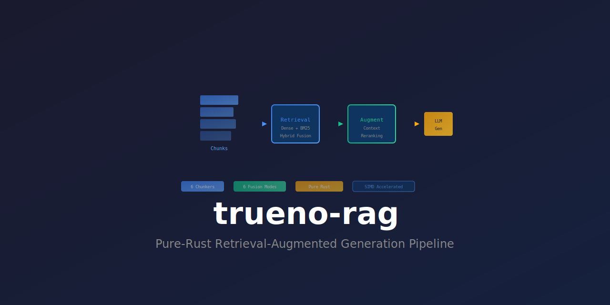

<div align="center">



**Pure-Rust Retrieval-Augmented Generation Pipeline**

[](https://crates.io/crates/trueno-rag)
[](https://docs.rs/trueno-rag)
[](https://github.com/paiml/trueno-rag/actions)
[](https://opensource.org/licenses/MIT)

</div>

---

SIMD-accelerated RAG pipeline built on [Trueno](https://crates.io/crates/trueno) compute primitives. Part of the [Sovereign AI Stack](https://github.com/paiml).

## Features

- **Pure Rust** - Zero Python/C++ dependencies
- **Chunking** - Recursive, Fixed, Sentence, Paragraph, Semantic, Structural
- **Hybrid Retrieval** - Dense (vector) + Sparse (BM25) search
- **Fusion** - RRF, Linear, DBSF, Convex, Union, Intersection
- **Reranking** - Lexical, cross-encoder, and composite rerankers
- **Metrics** - Recall, Precision, MRR, NDCG, MAP
- **Semantic Embeddings** - Production ONNX models via FastEmbed (optional)
- **Nemotron Embeddings** - NVIDIA Embed Nemotron 8B via GGUF (optional)
- **Index Compression** - LZ4/ZSTD compressed persistence (optional)

## Installation

```toml
[dependencies]
trueno-rag = "0.1.8"
```

## Quick Start

```rust
use trueno_rag::{
    pipeline::RagPipelineBuilder,
    chunk::RecursiveChunker,
    embed::MockEmbedder,
    rerank::LexicalReranker,
    fusion::FusionStrategy,
    Document,
};

let mut pipeline = RagPipelineBuilder::new()
    .chunker(RecursiveChunker::new(512, 50))
    .embedder(MockEmbedder::new(384))
    .reranker(LexicalReranker::new())
    .fusion(FusionStrategy::RRF { k: 60.0 })
    .build()?;

let doc = Document::new("Your content here...").with_title("Doc Title");
pipeline.index_document(&doc)?;

let (results, context) = pipeline.query_with_context("your query", 5)?;
```

## Examples

```bash
# Basic examples
cargo run --example basic_rag
cargo run --example chunking_strategies
cargo run --example hybrid_search
cargo run --example metrics_evaluation

# With semantic embeddings (downloads ~90MB ONNX model on first run)
cargo run --example semantic_embeddings --features embeddings

# With compressed index persistence
cargo run --example compressed_index --features compression

# With NVIDIA Nemotron embeddings (requires GGUF model file)
NEMOTRON_MODEL_PATH=/path/to/model.gguf cargo run --example nemotron_embeddings --features nemotron
```

## Optional Features

### Semantic Embeddings (FastEmbed)

Production-quality vector embeddings via FastEmbed (ONNX Runtime):

```toml
trueno-rag = { version = "0.1.8", features = ["embeddings"] }
```

```rust
use trueno_rag::embed::{FastEmbedder, EmbeddingModelType, Embedder};

let embedder = FastEmbedder::new(EmbeddingModelType::AllMiniLmL6V2)?;
let embedding = embedder.embed("Hello, world!")?;
// 384-dimensional embeddings
```

Available models:
- `AllMiniLmL6V2` - Fast, 384 dims (default)
- `AllMiniLmL12V2` - Better quality, 384 dims
- `BgeSmallEnV15` - Balanced, 384 dims
- `BgeBaseEnV15` - Higher quality, 768 dims
- `NomicEmbedTextV1` - Retrieval optimized, 768 dims

### NVIDIA Embed Nemotron 8B

High-quality 4096-dimensional embeddings via GGUF model inference:

```toml
trueno-rag = { version = "0.1.8", features = ["nemotron"] }
```

```rust
use trueno_rag::embed::{NemotronEmbedder, NemotronConfig, Embedder};

let config = NemotronConfig::new("models/NV-Embed-v2-Q4_K.gguf")
    .with_gpu(true)
    .with_normalize(true);
let embedder = NemotronEmbedder::new(config)?;

// Asymmetric retrieval - different prefixes for queries vs documents
let query_emb = embedder.embed_query("What is machine learning?")?;
let doc_emb = embedder.embed_document("Machine learning is a branch of AI...")?;
```

### Index Compression

LZ4/ZSTD compressed index persistence:

```toml
trueno-rag = { version = "0.1.8", features = ["compression"] }
```

```rust
use trueno_rag::{compressed::Compression, BM25Index};

let bytes = index.to_compressed_bytes(Compression::Zstd)?;
// 4-6x compression ratio
```

## Stack Dependencies

trueno-rag is part of the Sovereign AI Stack:

| Crate | Version | Purpose |
|-------|---------|---------|
| [trueno](https://crates.io/crates/trueno) | 0.11 | SIMD/GPU compute primitives |
| [trueno-db](https://crates.io/crates/trueno-db) | 0.3.10 | GPU-first analytics database |
| [realizar](https://crates.io/crates/realizar) | 0.5.1 | GGUF/APR model inference |
| [fastembed](https://crates.io/crates/fastembed) | 5.x | ONNX embeddings |

## Development

```bash
make test       # Run tests
make lint       # Clippy lints
make coverage   # Coverage report (95%+ target)
make book       # Build documentation book
```

## Documentation

- [API Documentation](https://docs.rs/trueno-rag)
- [User Guide](https://paiml.github.io/trueno-rag/)

## License

MIT
